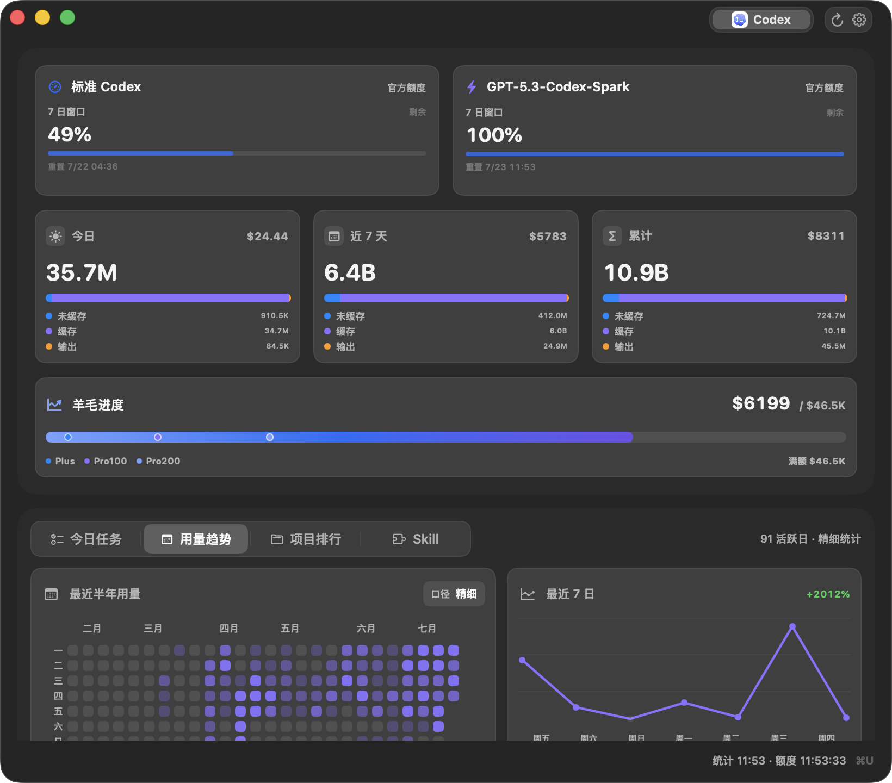
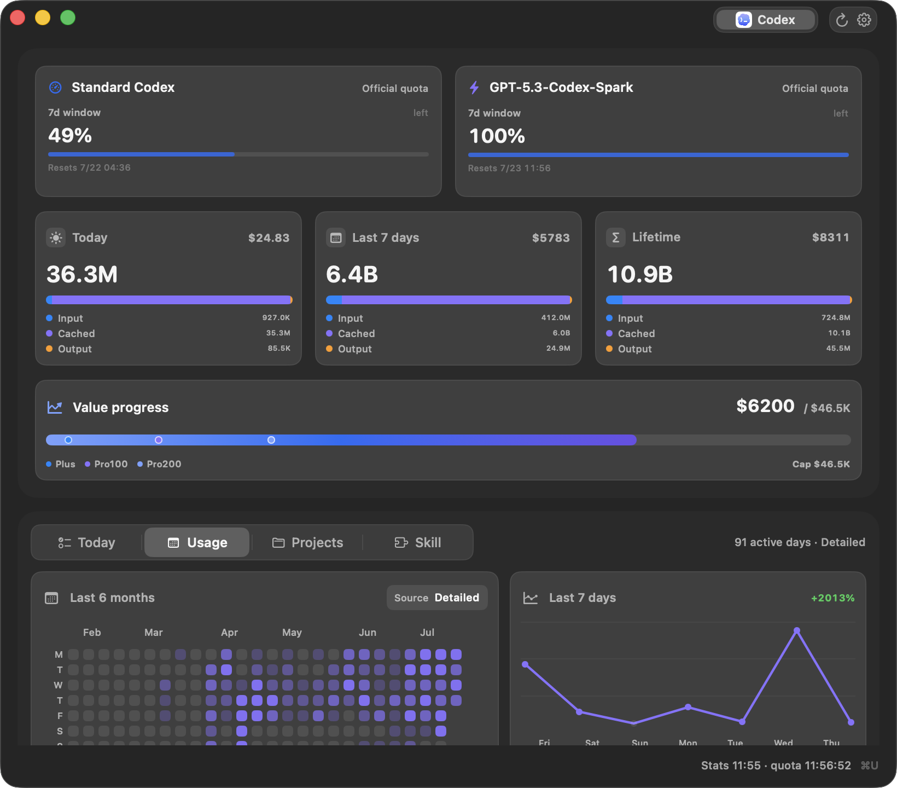

# tokenU Releases

tokenU 的公开下载与更新通道。这里仅保存发布说明、校验文件和 macOS DMG，不公开私有源码或用户数据。



## 下载与安装

从 [Latest Release](https://github.com/franzleeyan/tokenU-releases/releases/latest) 下载与你的 Mac 匹配的文件：

- Apple Silicon：`tokenU-<version>-mac-arm64.dmg`
- Intel：`tokenU-<version>-mac-x86_64.dmg`

打开 DMG，将 `tokenU.app` 拖入“应用程序”。tokenU 当前使用 ad-hoc 签名且未进行 Apple notarization；如果 macOS 阻止首次打开，请在“系统设置 → 隐私与安全性”中选择“仍要打开”，或在 Finder 中右键应用并选择“打开”。

下载后可验证 SHA-256：

```sh
shasum -a 256 -c tokenU-<version>-mac-<arch>.dmg.sha256
```

tokenU 只读取公开 Release 元数据来检查更新，不上传本机 usage、账户、线程、路径或日志。发现更新后仍由用户手动下载和安装。

## 致谢与上游

tokenU 基于 [shanggqm/codexU](https://github.com/shanggqm/codexU) 独立维护。感谢 `shanggqm`（MIT License 版权署名 `Guomeiqing`）创建和维护原始项目。本发布通道保留 MIT License；tokenU 的下游修改和发布不代表原作者或 OpenAI 背书。

---

## English

This repository is the public download and update channel for tokenU. It contains release notes, checksums, and macOS DMGs only; private source code and user data are not published here.



Download the matching asset from the [Latest Release](https://github.com/franzleeyan/tokenU-releases/releases/latest):

- Apple Silicon: `tokenU-<version>-mac-arm64.dmg`
- Intel: `tokenU-<version>-mac-x86_64.dmg`

Open the DMG and drag `tokenU.app` into Applications. Current builds are ad-hoc signed and not Apple-notarized. If macOS blocks the first launch, use **System Settings → Privacy & Security → Open Anyway**, or right-click the app in Finder and choose **Open**.

Verify the download with:

```sh
shasum -a 256 -c tokenU-<version>-mac-<arch>.dmg.sha256
```

tokenU reads only public Release metadata for update checks. It does not upload local usage, accounts, threads, paths, or logs, and installation always remains manual.

tokenU is independently maintained downstream from [shanggqm/codexU](https://github.com/shanggqm/codexU). We thank `shanggqm` / `Guomeiqing` for the original MIT-licensed project. Neither the original author nor OpenAI endorses downstream changes or releases.
